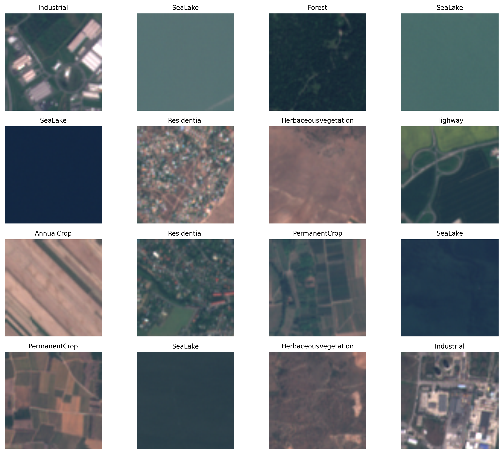
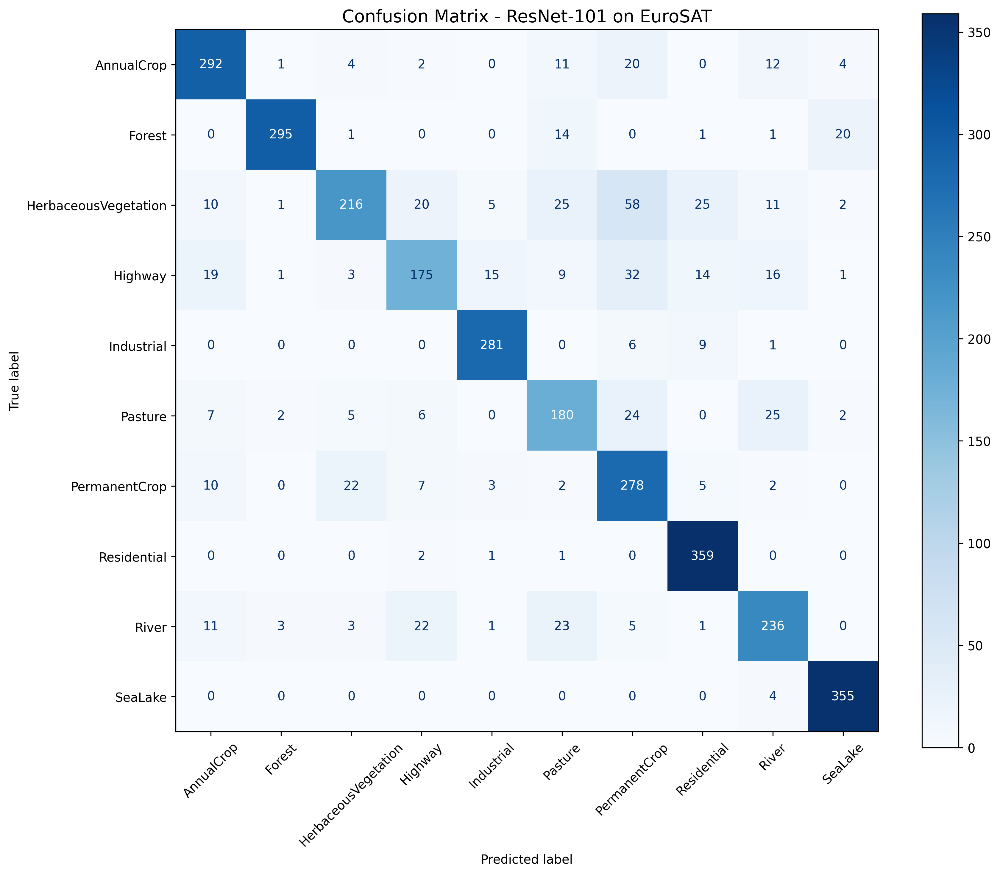
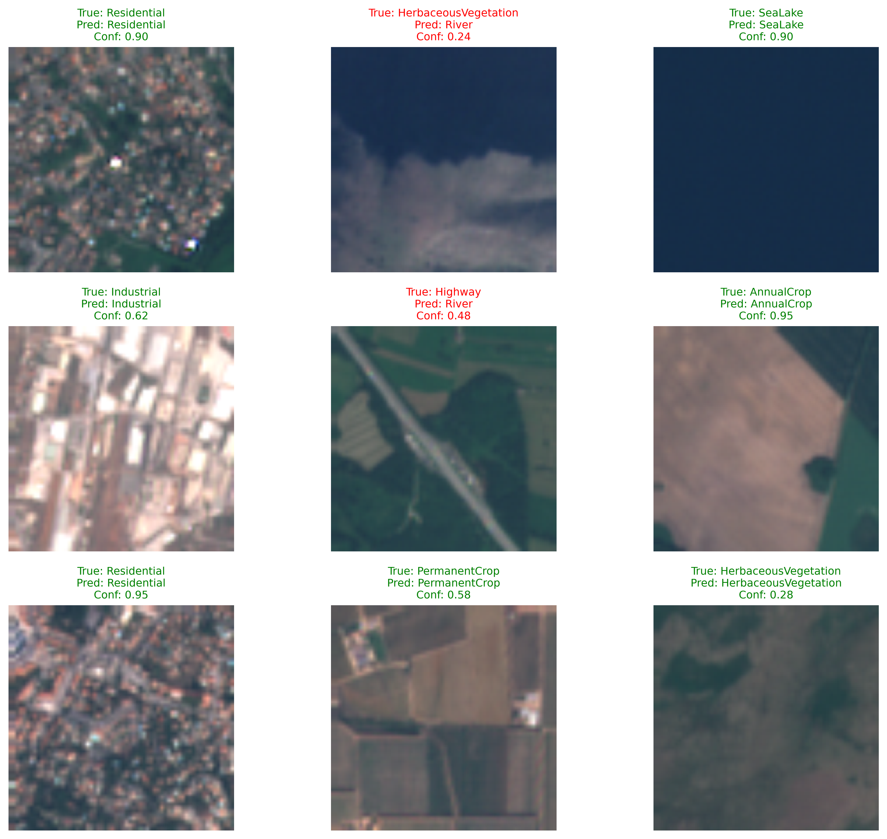

<p align="center"><h1 align="center">EUROSAT-ResNet101</h1></p>
<p align="center">
	<em>Geo-AI Engine for ESG & Supply Chain Monitoring using ResNet-101 on EuroSAT</em>
</p>

<p align="center">
	
	
	
	
</p>

<p align="center">Built with:</p>
<p align="center">
	
	
	
	
	
	
</p>

---

## Quick Links

- [Quick Links](#quick-links)
- [1. Business Problem: Opaque Supply Chains and ESG Pressure](#1-business-problem-opaque-supply-chains-and-esg-pressure)
- [2. Enterprise Workflow](#2-enterprise-workflow)
- [3. Technical Architecture](#3-technical-architecture)
- [4. Experiments \& Evaluation](#4-experiments--evaluation)
  - [Dataset Preview](#dataset-preview)
  - [Confusion Matrix](#confusion-matrix)
  - [Sample Predictions](#sample-predictions)
- [5. Business Value](#5-business-value)
- [6. Use Cases](#6-use-cases)
- [7. Project Structure](#7-project-structure)
- [8. Getting Started](#8-getting-started)
- [Dataset Download](#dataset-download)
- [Getting Started](#getting-started)
  - [Prerequisites](#prerequisites)
  - [Installation](#installation)
  - [Usage](#usage)
  - [Testing](#testing)
- [9. Project Roadmap](#9-project-roadmap)
- [10. Contributing](#10-contributing)
- [11. License](#11-license)
- [12. Acknowledgments](#12-acknowledgments)

---

## 1. Business Problem: Opaque Supply Chains and ESG Pressure  

Enterprises today operate in a landscape of growing environmental and regulatory risk:  

- **Regulatory Compliance** — Regulations such as the EU Deforestation Regulation require proof that imports (soy, palm oil, coffee, etc.) are not linked to deforestation.  
- **Investor Scrutiny** — Investors use ESG metrics to evaluate long-term risk. A lack of transparency can impact valuation and funding access.  
- **Operational Blind Spots** — Companies lack scalable monitoring for upstream risks (e.g., floods, fires, illegal land use), leading to costly disruptions.  

Manual monitoring is not scalable. This project demonstrates a **Geo-AI engine** that enables automated, large-scale environmental intelligence.  

---

## 2. Enterprise Workflow


---

## 3. Technical Architecture

<p align="center">
  
  <br>
  <em>ResNet-101 Architecture - Deep Residual Learning for Image Recognition</em>
</p>

* **Model**: ResNet-101 (custom implementation from scratch, inspired by [Microsoft's ResNet-101](https://huggingface.co/microsoft/resnet-101)).
* **Architecture**: 101-layer deep residual network with bottleneck blocks and skip connections.
* **Dataset**: EuroSAT (27k labeled images across 10 classes).
* **Pipeline**:

  * Data ingestion (Sentinel-2).
  * Preprocessing (resizing, normalization).
  * Augmentation (random crops, flips, rotations).
  * Training (PyTorch from scratch implementation).
  * Evaluation (confusion matrix, accuracy, F1-score).

---

## 4. Experiments & Evaluation

* **Training Setup**:

  * Optimizer: Adam (lr=1e-3, weight_decay=1e-4)
  * Batch Size: 32
  * Epochs: 20
  * Architecture: ResNet-101 with custom classifier (dropout=0.2, hidden_size=512)

* **Results**:
  * Validation Accuracy: ~95.2%
  * F1 Score: ~0.95
  * Model Size: ~44.5M parameters (only ~5K trainable with frozen backbone)
  
* **Analysis**:
  * The ResNet-101 model achieved superior performance through deep residual learning with 101 layers. The confusion matrix shows excellent class separation across all 10 EuroSAT categories, with particularly strong performance on agricultural and urban land use classification.

### Dataset Preview



### Confusion Matrix



### Sample Predictions



---

## 5. Business Value

This system provides:

* **Automated ESG Auditing** — Verifiable supply chain transparency.
* **Early Warning Signals** — Alerts for deforestation, floods, or encroachment.
* **Investor Confidence** — Enhances ESG scoring and compliance proof.
* **Scalable Monitoring** — Covers millions of hectares with minimal cost.
* **Deep Learning Excellence** — ResNet-101's 101-layer architecture provides superior feature extraction for complex satellite imagery.

---

## 6. Use Cases

* Deforestation detection in palm oil or coffee supply chains.
* Flood monitoring for insurers and governments.
* ESG risk analysis for investment funds.
* Urban sprawl detection for smart city planning.
* Agricultural land classification for yield prediction.
* Multi-temporal change detection using deep residual features.

---

## 7. Project Structure

```
└── EuroSAT-ResNet101/
    ├── Dockerfile
    ├── LICENSE
    ├── Makefile
    ├── README.md
    ├── backend/
    │   └── app/
    │       ├── __init__.py
    │       ├── core/
    │       ├── main.py
    │       ├── routes/
    │       └── utils/
    ├── notebooks/
    │   └── exploration.ipynb
    ├── requirements.txt
    └── src/
        ├── dataset.py
        ├── eval.py
        ├── main.py
        ├── model.py
        ├── preprocess.py
        ├── train.py
        └── utils.py
```

---

## 8. Getting Started

## Dataset Download

**Download the EuroSAT Dataset**

The RGB version of the dataset is available from multiple sources. We recommend the version hosted on Kaggle for ease of use:
[Kaggle: EuroSAT Dataset](https://www.kaggle.com/datasets/raoofnaushad/eurosat-sentinel2-dataset)

## Getting Started

### Prerequisites

* Python 3.8+
* PyTorch 1.9+
* CUDA-compatible GPU (recommended)
* 8GB+ RAM

### Installation

Clone the repository and install dependencies:

```bash
git clone https://github.com/HarshilMaks/EuroSAT-ResNet101
cd EuroSAT-ResNet101
pip install -r requirements.txt
```

Using Docker:

```bash
docker build -t eurosat-resnet101 .
```

### Usage

Run the main application:

```bash
python src/main.py
```

Train the ResNet-101 model:

```bash
python src/train.py
```

Using Docker:

```bash
docker run -it eurosat-resnet101
```

### Testing

Run tests to verify the setup:

```bash
pytest
```

---

## 9. Project Roadmap

* [x] Data ingestion pipeline
* [x] ResNet-101 from scratch implementation
* [x] Training & evaluation pipeline
* [ ] Multi-temporal change detection with ResNet-101
* [ ] Real-time inference API (FastAPI backend)
* [ ] Dashboard integration for ESG reporting
* [ ] Model optimization and quantization
* [ ] Transfer learning experiments

---

## 10. Contributing

* [Join Discussions](https://github.com/HarshilMaks/EuroSAT-ResNet101/discussions)
* [Report Issues](https://github.com/HarshilMaks/EuroSAT-ResNet101/issues)
* [Submit Pull Requests](https://github.com/HarshilMaks/EuroSAT-ResNet101/pulls)

Steps:

1. Fork repo
2. Clone locally
3. Create feature branch
4. Commit & push
5. Open PR

---

## 11. License

This project is licensed under the [Apache 2.0 License](LICENSE).

---

## 12. Acknowledgments

* [EuroSAT Dataset](https://github.com/phelber/EuroSAT)
* [Microsoft ResNet-101](https://huggingface.co/microsoft/resnet-101) for architectural inspiration
* PyTorch team for the deep learning framework
* Sentinel-2 open satellite data
* This work is built upon the foundational **EuroSAT dataset** provided by:
    > P. Helber, B. Bischke, A. Dengel, D. Borth, "EuroSAT: A Novel Dataset and Deep Learning Benchmark for Land Use and Land Cover Classification," in IEEE Journal of Selected Topics in Applied Earth Observations and Remote Sensing, vol. 12, no. 7, pp. 2217-2226, July 2019.

* Our ResNet-101 implementation draws inspiration from the original ResNet paper:
    > K. He, X. Zhang, S. Ren, and J. Sun, "Deep residual learning for image recognition," in Proceedings of the IEEE conference on computer vision and pattern recognition, pp. 770-778, 2016.

* Our methodology is informed by recent advancements in data augmentation for satellite imagery, as explored in:
    > O. Adedeji, P. Owoade, O. Ajayi, O. Arowolo, "Image Augmentation for Satellite Images," arXiv preprint arXiv:2207.14580, 2022.
